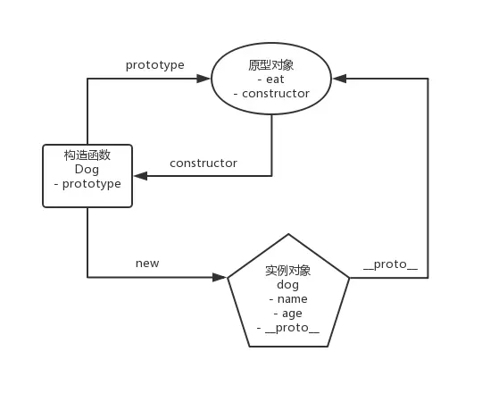

# 原型模式

## 原型

> 每个对象拥有一个原型对象,对象以其原型为模板,从原型继承方法和属性,这些属性和方法定义在对象的构造函数的 prototype 属性上，而非对象实例本身.

- 构造函数
- 原型对象
- 实例对象

1. 构造函数的 prototype 等于原型对象
2. 原型对象的 consturctor 等于构造函数
3. 实例对象的`__proto__`等于原型对象



```javascript
function Parent() {}
const p = new Parent();
console.log(p);
console.log(Parent.prototype);
console.log(p.constructor.prototype === Parent.prototype);
console.log(Parent.prototype.constructor === p.constructor);
console.log(p.constructor === Parent);
```

## 原型链

```javascript
function Parent() {}
const p = new Parent();
console.log(p.__proto__ === Parent.prototype);
console.log(p.__proto__.__proto__ === Object.prototype);
console.log(Object.prototype.__proto__);
console.log(p.__proto__.__proto__.__proto__);
```
