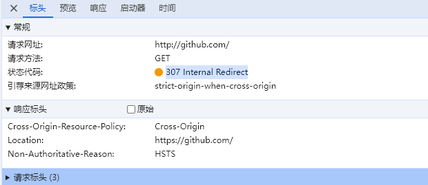
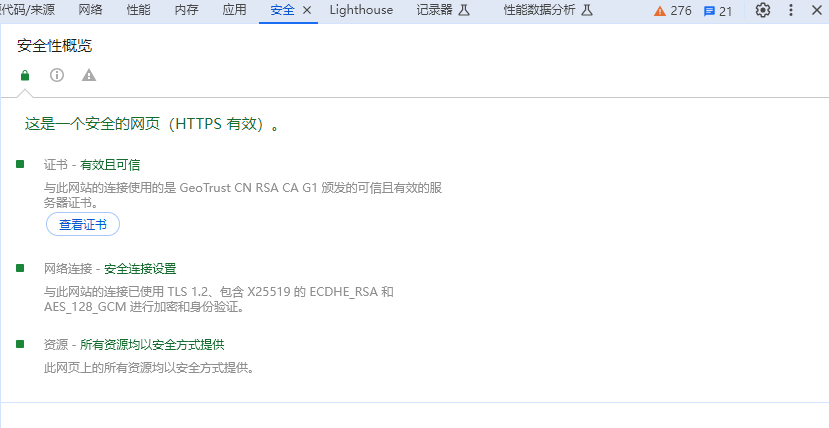

# https

## HSTS

1. 什么是 HSTS
   - http 严格传输安全、如果开启了 HSTS,当你访问 HTTP 站点时，浏览器会自动给你打开 HTTPS 站点
2. 访问http://github.com 跟http://bilibili.com的区别
   - github 返回的 307 Internal Redirect
   - b 站返回的是 301 Moved Permanently
3. 在浏览器控制台查看 307 Internal Redirect
   

## HTTPS 现状

1. HTTPS 默认端口号
   - 443
2. 如何查看某网站 HTTPS 所使用的 TLS 版本号与密码套件
   - 浏览器控制台 security（安全）
     
