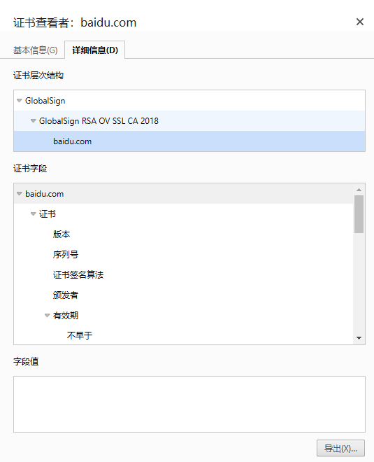

# https

## HSTS

1. 什么是 HSTS
   - http 严格传输安全、如果开启了 HSTS,当你访问 HTTP 站点时，浏览器会自动给你打开 HTTPS 站点
2. 访问http://github.com 跟http://bilibili.com的区别
   - github 返回的 307 Internal Redirect
   - b 站返回的是 301 Moved Permanently
3. 在浏览器控制台查看 307 Internal Redirect
   

## HTTPS 现状

1. HTTPS 默认端口号
   - 443
2. 如何查看某网站 HTTPS 所使用的 TLS 版本号与密码套件
   - 浏览器控制台 security（安全）
     

## TLS 简述

1. 简述 TLS 原理
   - 客户端与服务端双方协商支持的 TSL 版本号、支持的密码套件，并且相互传递随机数 Client Random 以及 Server Random
   - 基于非对称加密算法的密钥交换，客户端计算出 对称加密算法的预主密钥（pre-master secret），并由密钥交换算法将其传给服务端
   - 基于对称加密算法的数据加密， 客户端与服务端双方使用 预主秘钥、传递的随机数计算生成会话密钥（master secret），并使用该密钥加密数据
2. 对称加密与非对称加密都有哪些算法
   - 对称加密
     - DES/3DES 已废弃，被 AES 替代
     - AES 高级加密标准 TSL 使用最多的对称加密算法
   - 非对称加密
     - RSA
     - ECDSA: 基于椭圆曲线的数字签名算法
     - ECDHE: 基于椭圆曲线密码学的临时 Diffie-Hellman 密钥交换协议（TSL 握手过程中使用最多的秘钥交换算法）
3. 再 HTTPS 中为什么不一直都是用非对称加密进行传输数据加密
   - 因为非对称加密算法耗时较长、性能较差
   - 在 TSL 中，使用非对称加密仅仅传递对称加密的预主密钥，随后使用性能较好的对称加密进行通信

## TLS 1.2 简述

1. 说出 TLS 握手过程的每一步
   - 客户端发送 Client Hello
     - TLS 版本
     - 密码套件
     - Client Random
   - 服务端发送 Server Hello
     - 双方都支持的 TLS 版本
     - 密码套件
     - Server Random
   - Certificate
     - 服务端给客户端发送证书、身份验证及提供公钥
   - Server key exchange
     - 服务端给客户端发送密钥交换算法的一些参数
   - Server finished
   - Client key exchange
     - 客户端给服务端发送密钥交换算法的一些参数
     - 计算预主密钥（pre-master-secret）
     - 双方根据 Cilent Random、Server Random、pre-master-secret 生成对称加密的秘钥
   - Change cipher,change cipher spec
     - 告知以后的消息开始对称加密通信
   - Finished
     - 加密消息并完整性验证、标志着握手阶段成功并结束
   - Change cipher,change cipher spec
     - 告知以后的消息开始对称加密通信、此时服务器通过秘钥交换算法拿到预主密钥、根据三个参数生成 master secret finished
     - 加密消息并完整性验证、标志着握手阶段成功并结束

## TLS 1.2 抓包分析

## TLS 1.3 简述

1. 请列举 TLS 1.3 的一些优势
   - 性能
     - TLS 1.3 只需要一个 TTL，而 TLS 1.2 需要两个 TTL
   - 安全
     - TLS 1.3 删除了一些不安全的密码套件，比如弃用了 AES 的 CBC 工资模式，采用能够保障前向安全的密码套件

## 证书

1. 浏览各大网站的证书，查看其 SAN 配置

```javascript
// 百度
DNS 名称: baidu.com
DNS 名称: baifubao.com
DNS 名称: www.baidu.cn
DNS 名称: www.baidu.com.cn
DNS 名称: mct.y.nuomi.com
DNS 名称: apollo.auto
DNS 名称: dwz.cn
DNS 名称: *.baidu.com
DNS 名称: *.baifubao.com
DNS 名称: *.baidustatic.com
DNS 名称: *.bdstatic.com
DNS 名称: *.bdimg.com
DNS 名称: *.hao123.com
DNS 名称: *.nuomi.com
DNS 名称: *.chuanke.com
DNS 名称: *.trustgo.com
DNS 名称: *.bce.baidu.com
DNS 名称: *.eyun.baidu.com
DNS 名称: *.map.baidu.com
DNS 名称: *.mbd.baidu.com
DNS 名称: *.fanyi.baidu.com
DNS 名称: *.baidubce.com
DNS 名称: *.mipcdn.com
DNS 名称: *.news.baidu.com
DNS 名称: *.baidupcs.com
DNS 名称: *.aipage.com
DNS 名称: *.aipage.cn
DNS 名称: *.bcehost.com
DNS 名称: *.safe.baidu.com
DNS 名称: *.im.baidu.com
DNS 名称: *.baiducontent.com
DNS 名称: *.dlnel.com
DNS 名称: *.dlnel.org
DNS 名称: *.dueros.baidu.com
DNS 名称: *.su.baidu.com
DNS 名称: *.91.com
DNS 名称: *.hao123.baidu.com
DNS 名称: *.apollo.auto
DNS 名称: *.xueshu.baidu.com
DNS 名称: *.bj.baidubce.com
DNS 名称: *.gz.baidubce.com
DNS 名称: *.smartapps.cn
DNS 名称: *.bdtjrcv.com
DNS 名称: *.hao222.com
DNS 名称: *.haokan.com
DNS 名称: *.pae.baidu.com
DNS 名称: *.vd.bdstatic.com
DNS 名称: *.cloud.baidu.com
DNS 名称: click.hm.baidu.com
DNS 名称: log.hm.baidu.com
DNS 名称: cm.pos.baidu.com
DNS 名称: wn.pos.baidu.com
DNS 名称: update.pan.baidu.com
```

2. 浏览各大网站的证书，查看其证书链
   
