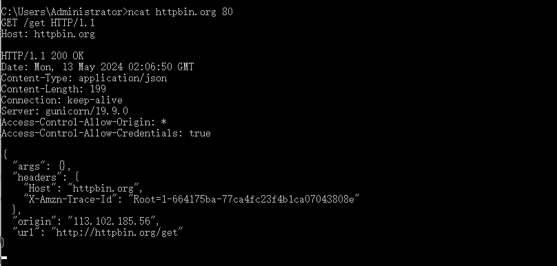
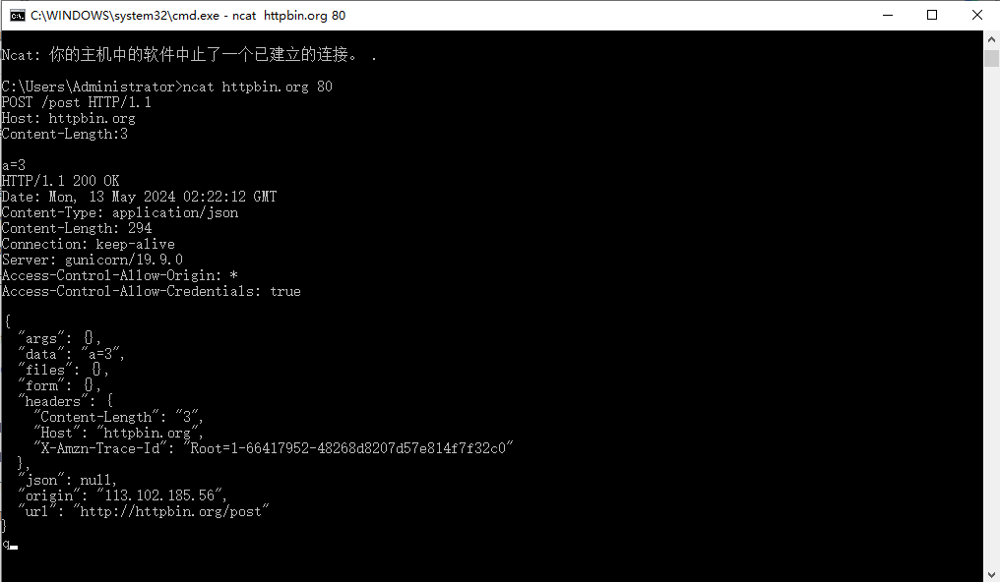
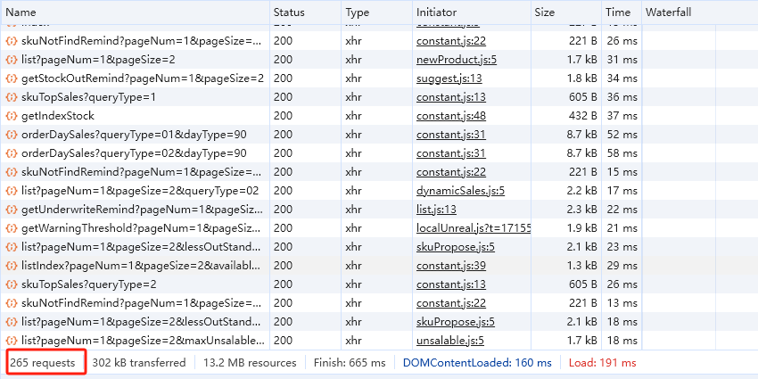

# 报文

## http 报文

1. 什么事 \r\n
   - 换行符
2. 如何找到文件中的 \r\n（windows）
   - 在 bash 中输入 cat -v "filePath"
   - 在编辑器里面打开正则匹配搜索
   - 查看 http 报文的换行符的话,在 bash 使用 curl -s -i baidu.com | cat -e
3. HTTP 报文格式是什么样的
   - 由请求及相应组成

```javascript
// 请求报文
// 首行为 Method Path Version构成
GET / HTTP/1.1
// 以下是请求头，Host是请求的域名
Host: www.baidu.com
User-Agent: curl/8.4.0
Accept: '*/*'
// 响应报文
// 相隔两个 \r\n 将会收到响应报文
// 行首由 Version StatusCode StatusText组成
HTTP/1.1 200 OK
// 以下是响应头
Accept-Ranges: bytes
Cache-Control: no-cache
Connection: keep-alive
Content-Length: 227
Content-Security-Policy: frame-ancestors 'self' https://chat.baidu.com http://mirror-chat.baidu.com https://fj-chat.baidu.com https://hba-chat.baidu.com https://hbe-chat.baidu.com https://njjs-chat.baidu.com https://nj-chat.baidu.com https://hna-chat.baidu.com https://hnb-chat.baidu.com http://debug.baidu-int.com;
Content-Type: text/html
Date: Sun, 12 May 2024 14:41:50 GMT
Pragma: no-cache
Server: BWS/1.1
Set-Cookie: BD_NOT_HTTPS=1; path=/; Max-Age=300
Set-Cookie: PSTM=1715524910; expires=Thu, 31-Dec-37 23:55:55 GMT; max-age=2147483647; path=/; domain=.baidu.com
Set-Cookie: H_PS_PSSID=40299_40080_60142_40463_60175_60269; path=/; expires=Mon, 12-May-25 14:41:50 GMT; domain=.baidu.com
Set-Cookie: BAIDUID=F9C79C8F94153DEA1C460AA59B922595:FG=1; Path=/; Domain=baidu.com; Max-Age=31536000
Set-Cookie: BAIDUID_BFESS=F9C79C8F94153DEA1C460AA59B922595:FG=1; Path=/; Domain=baidu.com; Max-Age=31536000; Secure; SameSite=None
Traceid: 1715524910186625741810703373082228342634
X-Ua-Compatible: IE=Edge,chrome=1
X-Xss-Protection: 1;mode=block
// 响应体
// 相隔两个 \r\n 将会收到响应体
```

4. 我们如何查看某次请求的 http 报文

   -curl -v https://www.baidu.com

## http 报文模拟(nc/telnet)

1. 安装 nc/telnet 命令行工具(windows)
   - https://nmap.org/download.html#windows 安装 nmap 使用 ncat 测试
   - 在控制面板->程序与功能->启动或关闭 windows 功能->开启 telnet 客户端
1. 通过 nc/telnet 使用 HTTP 报文与网站进行通信

   

1. 通过 nc/telnet 发送 GET/POST 报文

   

## Chrome Devtools

1. 在开发环境调试 http 请求时，如何只筛选出 locahost 上的所有请求
   - domain:localhost
2. 控制台左下角，transferred size 与 resource sieze 有何区别
   - transferred 压缩后的体积，有多少资源进行了传输， resource 未压缩时体积
3. 如何看出某个网站首页加载了多少个请求
   - 在首页的时候打开网络控制面板，查看底部状态栏，requests 查看加载度搜请求
     
4. 如何在控制台中显示 HTTP 协议一列
   - 右键网络控制台 - header options 选项 - 勾选 protocal
